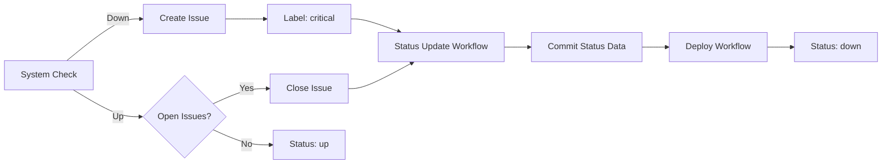

# Docusaurus Status Plugin

A Docusaurus plugin that creates an Upptime-like status monitoring dashboard powered by GitHub Issues and Actions. Perfect for tracking both system uptime and process-based issues, all embedded directly in your Docusaurus documentation site.

[](https://github.com/amiable-dev/docusaurus-plugin-stentorosaur/actions/workflows/ci.yml)
[](https://github.com/amiable-dev/docusaurus-plugin-stentorosaur/actions/workflows/publish.yml)

## Features

- 🎯 **Status Dashboard**: Beautiful, real-time status display for your systems and processes
- 🏗️ **Multiple Status Views** (v0.5.0+): Choose between default or Upptime-style structured layouts
- 🔧 **Scheduled Maintenance** (v0.5.0+): Track and display upcoming and past maintenance windows
- 📊 **Incident Timeline**: Historical view of all incidents with severity tracking
- 📈 **Interactive Charts** (v0.3.0+): Visualize response times and uptime with Chart.js
  - Line charts for response time trends
  - Bar charts and heatmaps for uptime visualization
  - Multiple time period views (24h, 7d, 30d, 90d)
  - Automatic dark/light theme support
  - Mini heatmaps on system cards (v0.10.1+): Redesigned 90-day uptime visualization with vertical rectangles
  - Extensible annotation system (v0.10.0+): Display maintenance windows and incidents as chart annotations
  - Markdown rendering support (v0.10.3+): Full GitHub-flavored markdown in incident and maintenance descriptions
- 💾 **Dataset Download** (v0.6.0+): Export chart data for offline analysis
  - Download data from any chart as CSV or JSON
  - All chart components include export buttons
  - Client-side data generation with no server load
  - Perfect for Excel, reports, BI tools, and compliance archiving
- 🎭 **Performance Metrics** (v0.3.1+): Advanced monitoring visualizations
  - Click system cards to show/hide detailed performance metrics
  - Side-by-side responsive chart layouts
  - Fullscreen zoom for detailed analysis
  - SLI/SLO compliance tracking with 99.9% default target
  - Error budget visualization and consumption tracking
  - Synchronized period selectors across all charts
- 🧩 **Embeddable Components**: Use charts anywhere in your Docusaurus site
  - Standalone ChartPanel component for MDX pages
  - Individual chart types (Response Time, Uptime, SLI, Error Budget)
  - Flexible layouts (horizontal/vertical)
  - All components fully swizzleable
- � **GitHub-Powered**: Uses GitHub Issues for incident tracking and Actions for monitoring
- ⚡ **Real-time Updates**: Automatically updates status via GitHub Actions (hourly by default)
- 🎨 **Customizable**: Fully themeable and configurable to match your site
- 📱 **Responsive**: Works perfectly on all devices
- 🔧 **Flexible**: Track both technical systems AND business/process issues

## Requirements

- **Node.js**: 20.0 or higher
- **Docusaurus**: 3.0 or higher (recommended: 3.9+ for full ES module support)

## Installation

```bash
npm install @amiable-dev/docusaurus-plugin-stentorosaur
# or
yarn add @amiable-dev/docusaurus-plugin-stentorosaur
```

> **📚 New in v0.7.0**: We recommend using an orphaned `status-data` branch for storing monitoring data (following the Upptime pattern). This keeps your main branch lean and improves performance. See [Orphaned Branch Setup Guide](./ORPHANED_BRANCH_SETUP.md) for migration instructions.

## GitHub Token Setup

The plugin uses a GitHub token to fetch status data from your repository's issues. This token is used in **two different contexts**:

### 1. Local Development & Build (Optional)

For local development and builds, set `process.env.GITHUB_TOKEN` in your environment:

**Create a Personal Access Token (PAT):**

1. Go to [GitHub Settings → Developer settings → Personal access tokens](https://github.com/settings/tokens)
2. Click "Generate new token (classic)"
3. Give it a descriptive name (e.g., "Docusaurus Status Plugin")
4. Select scopes:
   - ✅ `repo` (for private repositories)
   - ✅ `public_repo` (for public repositories only)
5. Generate and copy the token

**Set up locally:**

Create a `.env` file in your Docusaurus project root:

```bash
# .env
GITHUB_TOKEN=ghp_your_token_here
```

Then load it in your `docusaurus.config.js`:

```javascript
// If using dotenv
require('dotenv').config();

module.exports = {
  plugins: [
    [
      '@amiable-dev/docusaurus-plugin-stentorosaur',
      {
        owner: 'your-org',
        repo: 'your-repo',
        token: process.env.GITHUB_TOKEN, // Uses .env token
        entities: [
          { name: 'api', type: 'system', displayName: 'API Service' },
          { name: 'website', type: 'system', displayName: 'Website' },
          { name: 'database', type: 'system', displayName: 'Database' },
        ],
      },
    ],
  ],
};
```

> **Note:** The token is **optional** for local development. Without it, the plugin will display demo data, which is useful for testing layouts and components.

### 2. GitHub Actions Deployment

When deploying with GitHub Actions, you **must explicitly pass** the `GITHUB_TOKEN` to your build step via the `env:` block.

> ⚠️ **Important:** While `secrets.GITHUB_TOKEN` is automatically available in GitHub Actions workflows, it is NOT automatically in `process.env.GITHUB_TOKEN` unless you explicitly pass it via `env:`.

**For GitHub Pages deployment**, use the standard Docusaurus deployment workflow:

> 📚 **Reference:** [Docusaurus Deployment Documentation](https://docusaurus.io/docs/deployment#triggering-deployment-with-github-actions)

```yaml
# .github/workflows/deploy.yml
name: Deploy to GitHub Pages

on:
  push:
    branches:
      - main
    # Review gh actions docs if you want to further define triggers, paths, etc
    # https://docs.github.com/en/actions/using-workflows/workflow-syntax-for-github-actions#on

jobs:
  build:
    name: Build Docusaurus
    runs-on: ubuntu-latest
    steps:
      - uses: actions/checkout@v4
        with:
          fetch-depth: 0
      - uses: actions/setup-node@v4
        with:
          node-version: 20
          cache: npm

      - name: Install dependencies
        run: npm ci
      - name: Build website
        env:
          GITHUB_TOKEN: ${{ secrets.GITHUB_TOKEN }}
        run: npm run build

      - name: Upload Build Artifact
        uses: actions/upload-pages-artifact@v3
        with:
          path: build

  deploy:
    name: Deploy to GitHub Pages
    needs: build

    # Grant GITHUB_TOKEN the permissions required to make a Pages deployment
    permissions:
      pages: write      # to deploy to Pages
      id-token: write   # to verify the deployment originates from an appropriate source

    # Deploy to the github-pages environment
    environment:
      name: github-pages
      url: ${{ steps.deployment.outputs.page_url }}

    runs-on: ubuntu-latest
    steps:
      - name: Deploy to GitHub Pages
        id: deployment
        uses: actions/deploy-pages@v4
```

For **test deployments on pull requests**, create a separate workflow:

```yaml
# .github/workflows/test-deploy.yml
name: Test deployment

on:
  pull_request:
    branches:
      - main
    # Review gh actions docs if you want to further define triggers, paths, etc
    # https://docs.github.com/en/actions/using-workflows/workflow-syntax-for-github-actions#on

jobs:
  test-deploy:
    name: Test deployment
    runs-on: ubuntu-latest
    steps:
      - uses: actions/checkout@v4
        with:
          fetch-depth: 0
      - uses: actions/setup-node@v4
        with:
          node-version: 20
          cache: npm

      - name: Install dependencies
        run: npm ci
      - name: Test build website
        env:
          GITHUB_TOKEN: ${{ secrets.GITHUB_TOKEN }}
        run: npm run build
```

**Key Points:**

- ✅ **Separate workflows** - Use `deploy.yml` for deployments and `test-deploy.yml` for PR testing
- ✅ **Modern actions** - Uses `actions/deploy-pages@v4` instead of deprecated peaceiris actions
- ✅ **Proper permissions** - Configures `pages: write` and `id-token: write` for GitHub Pages
- ✅ **Build artifacts** - Uses `actions/upload-pages-artifact@v3` to pass build between jobs
- ✅ **GITHUB_TOKEN** - Must pass via `env:` block in build step
- ✅ **Fetch depth** - Uses `fetch-depth: 0` for full git history (useful for git-based features)
- ✅ **Node caching** - Enables npm caching with `cache: npm` (or `cache: yarn` for Yarn users)

> 📖 **Using Yarn?** Replace `cache: npm` with `cache: yarn` and `npm ci` with `yarn install --frozen-lockfile`

> 💡 **Tip:** If your production site shows demo data, you forgot to add the `env:` block to your build step!

### 3. Other CI/CD Platforms

For platforms like Netlify, Vercel, or custom CI/CD:

1. Create a GitHub PAT (as described above)
2. Add it as an environment variable in your platform's dashboard:
   - **Netlify**: Site settings → Build & deploy → Environment → Environment variables
   - **Vercel**: Project settings → Environment Variables
   - **Custom CI**: Add to your CI platform's secrets/environment variables

Set the variable name as `GITHUB_TOKEN` with your PAT value.

## Configuration

### Basic Setup

Add the plugin to your `docusaurus.config.js`:

```javascript
module.exports = {
  // ... other config
  plugins: [
    [
      '@amiable-dev/docusaurus-plugin-stentorosaur',
      {
        // GitHub repository (defaults to site's organizationName/projectName)
        owner: 'your-org',
        repo: 'your-repo',

        // NEW in v0.11.0: Entity Configuration (REQUIRED)
        // Define entities to track - replaces systemLabels
        entities: [
          // Systems (technical infrastructure)
          {
            name: 'api',
            type: 'system',
            displayName: 'API Service',
            description: 'Main REST API',
          },
          {
            name: 'database',
            type: 'system',
            displayName: 'Database',
          },

          // Processes (business flows)
          {
            name: 'customer-onboarding',
            type: 'process',
            displayName: 'Customer Onboarding',
            description: 'End-to-end onboarding flow',
          },

          // Projects (time-bound initiatives)
          {
            name: 'migration-aurora',
            type: 'project',
            displayName: 'Aurora Migration',
          },
        ],
        
        // Optional: GitHub token for API requests
        // Best practice: use environment variable
        token: process.env.GITHUB_TOKEN,
        
        // Status page configuration
        title: 'System Status',
        description: 'Current status of our systems and services',
        
        // Display options
        showResponseTimes: true,
        showUptime: true,
        
        // NEW in v0.3.1: Performance metrics visualization
        showPerformanceMetrics: true,  // Enable/disable performance charts (default: true)
        
        // NEW in v0.5.0: Status page layout style
        statusView: 'upptime',  // 'default' | 'upptime' (default: 'default')
        
        // NEW in v0.5.0: Configure Upptime-style sections
        uptimeConfig: {
          sections: [
            { id: 'active-incidents', enabled: true },
            { id: 'live-status', enabled: true },
            { id: 'charts', enabled: true },
            { id: 'scheduled-maintenance', enabled: true },
            { id: 'past-maintenance', enabled: true },
            { id: 'past-incidents', enabled: true },
          ],
          sectionTitles: {
            'scheduled-maintenance': '🔧 Upcoming Maintenance',
          },
        },
        
        // NEW in v0.5.0: Scheduled maintenance tracking
        scheduledMaintenance: {
          enabled: true,
          labels: ['maintenance'],    // GitHub labels for maintenance issues
          displayDuration: 30,        // Show completed maintenance for 30 days
          timezone: 'America/New_York', // Display times in specific timezone
        }
        
        // Demo data control (useful for testing)
        // Default: true when no token, false when token provided
        useDemoData: !process.env.GITHUB_TOKEN,
        
        // Content visibility
        showServices: true,    // Show/hide services status board (default: true)
        showIncidents: true,   // Show/hide incident history (default: true)
        
        // Update interval in minutes (default: 60)
        updateInterval: 60,
      },
    ],
  ],
};
```

### Entity Configuration (v0.11.0+)

Starting in v0.11.0, the plugin uses an **entity model** instead of simple `systemLabels`. This allows you to track different types of entities with rich metadata.

#### Entity Types

The plugin supports six entity types:

- **system**: Technical infrastructure (APIs, databases, services)
- **process**: Business processes (onboarding, billing, support)
- **project**: Time-bound initiatives (migrations, feature launches)
- **event**: Scheduled events (campaigns, product launches)
- **sla**: Service level tracking (uptime SLAs, performance targets)
- **custom**: User-defined entity types

#### Entity Fields

```typescript
interface Entity {
  name: string;              // Required: Unique identifier (kebab-case recommended)
  type: EntityType;          // Required: Entity type
  displayName?: string;      // Optional: Human-readable name
  description?: string;      // Optional: Short description
  icon?: string;             // Optional: Emoji or icon identifier
  metadata?: Record<string, any>; // Optional: Custom metadata
}
```

#### Label Parsing

Entities can be identified from GitHub issue labels using two schemes:

**Namespaced Labels** (default):

```text
system:api
process:onboarding
project:migration-aurora
```

**Legacy Labels** (backward compatible):

```text
api
onboarding
migration-aurora
```

Configure the label scheme in plugin options:

```javascript
{
  entities: [...],
  labelScheme: 'namespaced',  // 'namespaced' | 'legacy' (default: 'namespaced')
}
```

#### Migration from systemLabels

If you're upgrading from v0.10.x or earlier, use the migration script:

```bash
node node_modules/@amiable-dev/docusaurus-plugin-stentorosaur/scripts/migrate-config.js docusaurus.config.ts
```

The script will:

1. Convert `systemLabels` array to `entities` array
2. Create entities with type='system'
3. Preserve your existing configuration
4. Show a diff of changes before applying

See `ENTITY-MODEL-IMPLEMENTATION.md` for full technical details.

### GitHub Actions Setup

#### 1. Copy Workflow Templates

Copy the workflow files from `templates/workflows/` to your `.github/workflows/` directory:

```bash
mkdir -p .github/workflows
cp node_modules/@amiable-dev/docusaurus-plugin-stentorosaur/templates/workflows/*.yml .github/workflows/
```

#### 2. Configure Monitoring

**IMPORTANT (v0.4.10+)**: The workflow now uses **sequential monitoring** to eliminate race conditions and guarantee zero data loss.

Create `.monitorrc.json` in your repository root:

```json
{
  "systems": [
    {
      "system": "api",
      "url": "https://api.example.com/health",
      "method": "GET",
      "timeout": 10000,
      "expectedCodes": [200, 301, 302],
      "maxResponseTime": 30000
    },
    {
      "system": "website",
      "url": "https://example.com",
      "method": "GET",
      "timeout": 10000,
      "expectedCodes": [200],
      "maxResponseTime": 30000
    }
  ]
}
```

The workflow automatically uses this config file:

```yaml
- name: Monitor all systems
  run: |
    npx -y -p @amiable-dev/docusaurus-plugin-stentorosaur stentorosaur-monitor \
      --config .monitorrc.json \
      --verbose
```

**Why Sequential Instead of Parallel?**

- ✅ **Zero data loss** - Single commit contains all systems' data
- ✅ **No race conditions** - No concurrent git operations
- ✅ **No merge conflicts** - Single job = single push
- ✅ **Scales reliably** - Works with 2 or 100 systems without data loss
- ⚠️ **Trade-off**: Runtime is ~5s per system (sequential) vs ~5s total (parallel)
  - 2 systems: 10s vs 5s, but 0% data loss vs 50%
  - 10 systems: 50s vs 5s, but 0% data loss vs potential 90%

**For systems at scale** (10+ endpoints), the sequential approach guarantees every monitoring check is captured, while parallel matrix jobs would lose data on git push conflicts.

#### 3. Setup Issue Templates (Optional)

Copy the issue templates for manual status reporting and maintenance scheduling:

```bash
mkdir -p .github/ISSUE_TEMPLATE
cp node_modules/@amiable-dev/docusaurus-plugin-stentorosaur/templates/ISSUE_TEMPLATE/*.yml .github/ISSUE_TEMPLATE/
```

**Available templates:**

- `status-issue.yml` - Report system or process status issues
- `scheduled-maintenance.yml` - Schedule maintenance windows (v0.5.0+)

### Creating Maintenance Tickets (v0.5.0+)

To schedule and display maintenance windows on your status page, create GitHub issues with the `maintenance` label and YAML frontmatter:

#### Maintenance Issue Format

```markdown
---
start: 2025-11-10T02:00:00Z
end: 2025-11-10T04:00:00Z
systems:
  - API Service
  - Main Website
---

We will be performing a database migration to improve query performance. The API and website will be in read-only mode during this window.

**Impact:**
- API endpoints will return cached data
- No new user registrations during maintenance

**Rollback Plan:**
Database snapshots created. Can restore within 15 minutes if needed.
```

#### Required Frontmatter Fields

- **`start`** (required): Maintenance start time in ISO 8601 format (UTC recommended)
- **`end`** (required): Maintenance end time in ISO 8601 format
- **`systems`** (optional): Array of affected entity names. If omitted, uses issue labels matching your `entities` configuration

#### Labels

- Add the **`maintenance`** label (or your custom label from `scheduledMaintenance.label` config)
- Optionally add system labels like `api`, `website`, etc.

#### Issue Comments

Add comments to provide updates during maintenance:

```markdown
Starting maintenance as scheduled.
```

```markdown
Database migration 50% complete. On track for 4:00 AM completion.
```

```markdown
Maintenance completed successfully. All systems operational.
```

Comments appear in the maintenance timeline on your status page.

#### Status Determination

The plugin automatically determines maintenance status:

- **Upcoming**: Start time is in the future
- **In Progress**: Current time is between start and end
- **Completed**: End time has passed OR issue is closed

#### Maintenance Window Monitoring Behavior

During active maintenance windows (status = "in-progress"), the monitoring system automatically:

- **Skips uptime monitoring** for affected systems to avoid polluting performance data with abnormal metrics
- **Prevents incident creation** for systems undergoing maintenance (no false alarms)
- **Logs skipped systems** in monitoring summaries for transparency

This ensures your historical performance data remains accurate and incidents are only created for genuine outages.

#### Example Maintenance Issue

**Title:** Database Migration and Index Optimization

**Labels:** `maintenance`, `api`, `website`

**Body:**

```markdown
---
start: 2025-11-15T02:00:00Z
end: 2025-11-15T04:00:00Z
systems:
  - API Service
  - Main Website
  - Documentation
---

Annual database migration to PostgreSQL 16 with index optimization.

**Expected Impact:**
- 2-hour maintenance window
- Read-only mode for all services
- API rate limits reduced to 10 req/min

**Preparation:**
- ✅ Database backups completed
- ✅ Rollback procedure tested
- ✅ Stakeholders notified
```

**Close the issue** when maintenance is complete to mark it as "Completed" on your status page.

## Usage

### Viewing the Status Page

Once configured, the plugin automatically creates a `/status` route on your Docusaurus site.

Visit `https://your-site.com/status` to see the status dashboard.

### Interactive Performance Metrics (v0.3.1+)

When `showPerformanceMetrics: true` (default), each system card on the status page is clickable:

**Click Behavior:**

1. **Click a system card** → Performance metrics slide down below the card
2. **Click a different system** → Previous metrics hide, new system's metrics show
3. **Click the active system again** → Metrics hide (toggle off)

**Performance Metrics Display:**

- **Response Time Chart**: Line chart showing response time trends
- **Uptime Chart**: Bar/heatmap visualization of availability
- **SLI/SLO Chart**: Service Level Indicator tracking against 99.9% target
- **Error Budget Chart**: Remaining error budget consumption

**Period Selection:**

- Toggle between 24h, 7d, 30d, or 90d views
- Period selection synchronizes across ALL charts simultaneously

**Fullscreen Zoom:**

- Click any chart to view it fullscreen
- Enhanced detail view for analysis
- Click anywhere to close and return to normal view

**Responsive Layout:**

- Desktop: Charts display in 2x2 grid (side-by-side)
- Tablet/Mobile: Charts stack vertically for optimal viewing

**Keyboard Navigation:**

- Tab to focus system cards
- Enter or Space to toggle metrics
- Full ARIA accessibility support

**Back Navigation:**

- In detailed history view, click "← Back to Status" to return to main page

### Embedding Status Components

You can embed status components in your docs or blog posts:

```mdx
---
title: System Status
---

import StatusBoard from '@theme/StatusBoard';
import IncidentHistory from '@theme/IncidentHistory';

# Our Systems

<StatusBoard 
  items={[
    { name: 'API', status: 'up', uptime: '99.9%' },
    { name: 'Website', status: 'up', uptime: '99.95%' },
    { name: 'Database', status: 'degraded', uptime: '98.5%' }
  ]}
/>

## Recent Incidents

<IncidentHistory 
  incidents={[
    // Your incident data
  ]}
  maxItems={5}
/>
```

### Embedding Performance Charts (v0.3.1+)

Use the `ChartPanel` component to embed performance metrics anywhere in your Docusaurus site:

#### All Charts for a System

```mdx
---
title: API Performance
---

import ChartPanel from '@theme/ChartPanel';

# API Monitoring Dashboard

<ChartPanel 
  systemName="api"
  showCharts={['response', 'uptime', 'sli', 'errorBudget']}
  defaultPeriod="7d"
  layout="horizontal"
/>
```

#### Individual Chart Types

**Response Time Chart:**

```mdx
<ChartPanel 
  systemName="api"
  showCharts={['response']}
  defaultPeriod="30d"
/>
```

**Uptime Heatmap:**

```mdx
<ChartPanel 
  systemName="database"
  showCharts={['uptime']}
  defaultPeriod="90d"
/>
```

**SLI/SLO Compliance:**

```mdx
<ChartPanel 
  systemName="api"
  showCharts={['sli']}
  defaultPeriod="30d"
  sloTarget={99.95}
/>
```

**Error Budget Tracking:**

```mdx
<ChartPanel 
  systemName="api"
  showCharts={['errorBudget']}
  defaultPeriod="30d"
  sloTarget={99.9}
/>
```

#### Chart Panel Props

```typescript
interface ChartPanelProps {
  systemName: string;                           // Required: system to display
  showCharts?: ('response' | 'uptime' | 'sli' | 'errorBudget')[];  // Default: all
  defaultPeriod?: '24h' | '7d' | '30d' | '90d'; // Default: '7d'
  layout?: 'horizontal' | 'vertical';           // Default: 'horizontal'
  sloTarget?: number;                           // Default: 99.9 (percent)
}
```

**Layout Options:**

- `horizontal`: Charts display side-by-side (2x2 grid on desktop, responsive stacking on mobile)
- `vertical`: Charts always stack vertically (useful for narrow layouts)

**Chart Types:**

- `response`: Response time line chart
- `uptime`: Uptime bar/heatmap chart
- `sli`: SLI/SLO compliance line chart with target line
- `errorBudget`: Error budget consumption bar chart

### Issue Labeling

The plugin uses GitHub issue labels to track status:

**Required Labels:**

- `status` - Identifies status-related issues

**Entity Labels:**

- Use labels matching your `entities` config to tag which entity is affected
- Namespaced format (default): `system:api`, `process:onboarding`, `project:migration`
- Legacy format: `api`, `onboarding`, `migration` (configure with `labelScheme: 'legacy'`)

**Severity Labels:**

- `critical` - Complete outage
- `major` - Significant degradation
- `minor` - Partial issues  
- `maintenance` - Planned work

### Manual Status Updates

You can manually create status issues using:

1. **GitHub UI**: Use the issue template at `.github/ISSUE_TEMPLATE/status-issue.yml`
2. **API/CLI**: Create issues programmatically with appropriate labels
3. **Automation**: Trigger from your monitoring tools (PagerDuty, DataDog, etc.)

### CLI Tool

The plugin includes a CLI tool for updating status data:

```bash
npx stentorosaur-update-status
```

**Options:**

- `--help` - Show usage information and examples
- `--output-dir <path>` - Specify custom output directory (default: `status-data`)
- `--verbose` - Enable detailed logging for debugging
- `--commit` - Auto-commit changes with emoji messages (🟩🟨🟥📊)

**Examples:**

```bash
# Update status data with verbose logging
npx stentorosaur-update-status --verbose

# Update and commit changes automatically
npx stentorosaur-update-status --commit

# Custom output directory
npx stentorosaur-update-status --output-dir ./public/status

# Combine multiple options
npx stentorosaur-update-status --verbose --commit --output-dir ./public/status
```

The CLI tool:

- Fetches status issues from GitHub
- Generates status data files (`summary.json` and `status.json`)
- Optionally commits changes with descriptive emoji messages
- Can be used in local development or CI/CD pipelines
- Provides helpful error messages with examples

## Monitoring Architecture (v0.4.0+)

### New Append-Only Data Storage

As of v0.4.0, the plugin uses an **append-only monitoring architecture** that eliminates Git history pollution and improves performance:

**Key Features:**

- 📝 **Append-only JSONL files** - One line per check, no file rewrites
- ⚡ **Hot file (current.json)** - 14-day rolling window (~200-400 KB)
- 🗜️ **Automatic compression** - Daily gzip of old archives (80-90% reduction)
- 🚀 **Fast site loads** - Small current.json file loads quickly
- 🧹 **Clean Git history** - Minimal commits, no data pollution

**Data Structure:**

```text
status-data/                               # Committed to Git
├── current.json                           # Hot file (rolling 14-day window)
└── archives/
    └── 2025/11/
        ├── history-2025-11-01.jsonl.gz   # Compressed (yesterday and older)
        ├── history-2025-11-02.jsonl.gz   # Compressed
        └── history-2025-11-03.jsonl      # Uncompressed (today)
```

**Setup:**

```bash
# Copy monitoring workflows
cp node_modules/@amiable-dev/docusaurus-plugin-stentorosaur/templates/workflows/monitor-systems.yml .github/workflows/
cp node_modules/@amiable-dev/docusaurus-plugin-stentorosaur/templates/workflows/compress-archives.yml .github/workflows/

# Configure your endpoints in monitor-systems.yml
```

See [MONITORING_SYSTEM.md](./MONITORING_SYSTEM.md) for complete documentation.

### Three-File Data Architecture (v0.4.11+)

The plugin now uses a **three-file data architecture** that separates monitoring data from incident data for improved performance and smart deployments:

```text
status-data/
├── current.json          # Time-series monitoring readings (every 5min, 14-day window)
├── incidents.json        # Active and resolved incidents from GitHub Issues
└── maintenance.json      # Scheduled maintenance windows
```

**File Purposes:**

| File | Updated By | Update Frequency | Purpose |
|------|------------|------------------|---------|
| `current.json` | `monitor-systems.yml` | Every 5 minutes | Live endpoint status, response times, health checks |
| `incidents.json` | `status-update.yml` | On issue events + hourly | Incidents tracked via GitHub Issues with `status` label |
| `maintenance.json` | `status-update.yml` | On issue events + hourly | Maintenance windows with `maintenance` label |

**Why Three Files?**

- ✅ **Separation of Concerns**: Monitoring data separate from incident tracking
- ✅ **Smart Deployments**: Critical incidents trigger immediate deploys, monitoring data doesn't
- ✅ **Performance**: Plugin only reads incident data when needed
- ✅ **Reduced Noise**: Monitoring commits use `[skip ci]`, don't trigger unnecessary builds

**Data Flow:**

```text
┌─────────────────────────────────────────────────────────────────┐
│  MONITORING FLOW (Every 5 minutes)                              │
├─────────────────────────────────────────────────────────────────┤
│  monitor-systems.yml                                            │
│    ↓                                                            │
│  Check all endpoints (sequential)                               │
│    ↓                                                            │
│  Append to archives/YYYY/MM/history-YYYY-MM-DD.jsonl           │
│    ↓                                                            │
│  Rebuild current.json (14-day rolling window)                   │
│    ↓                                                            │
│  Commit with [skip ci] → NO DEPLOYMENT TRIGGERED                │
│    ↓                                                            │
│  If critical failure → Create GitHub Issue with 'critical' label│
└─────────────────────────────────────────────────────────────────┘

┌─────────────────────────────────────────────────────────────────┐
│  INCIDENT FLOW (On issue events + hourly)                       │
├─────────────────────────────────────────────────────────────────┤
│  GitHub Issue created/updated (with 'status' or 'maintenance')  │
│    ↓                                                            │
│  status-update.yml triggered                                    │
│    ↓                                                            │
│  Fetch issues from GitHub API                                   │
│    ↓                                                            │
│  Generate incidents.json + maintenance.json                     │
│    ↓                                                            │
│  Commit with [skip ci]                                          │
│    ↓                                                            │
│  If CRITICAL incident → Trigger repository_dispatch event       │
│    ↓                                                            │
│  deploy.yml triggered → IMMEDIATE DEPLOYMENT (~2 min)           │
│                                                                 │
│  If NON-CRITICAL → Wait for hourly scheduled deployment         │
└─────────────────────────────────────────────────────────────────┘

┌─────────────────────────────────────────────────────────────────┐
│  DEPLOYMENT FLOW                                                │
├─────────────────────────────────────────────────────────────────┤
│  Deploy Triggers:                                               │
│    • Push to main (code changes)                                │
│    • repository_dispatch: status-updated (critical incidents)   │
│    • Hourly schedule (non-critical updates)                     │
│    • Manual workflow_dispatch                                   │
│    ↓                                                            │
│  Checkout repository (includes all 3 status files)              │
│    ↓                                                            │
│  Plugin reads current.json + incidents.json + maintenance.json  │
│    ↓                                                            │
│  Build static site with aggregated data                         │
│    ↓                                                            │
│  Deploy to GitHub Pages                                         │
└─────────────────────────────────────────────────────────────────┘
```

**Smart Deployment Logic (v0.4.13+):**

The `deploy.yml` workflow has been enhanced with intelligent triggers:

- **Ignores monitoring data commits**: `paths-ignore` for `status-data/current.json` and archives
- **Immediate critical deploys**: `repository_dispatch` event when critical incidents occur
- **Scheduled non-critical**: `deploy-scheduled.yml` runs hourly to pick up routine updates

This means:

- ⚡ **Critical incidents** deploy within ~2 minutes via `repository_dispatch`
- 🕐 **Non-critical incidents** deploy within 1 hour via scheduled workflow
- 🚫 **Monitoring commits** (every 5 min) don't trigger any deployments

**CLI Options for Status Update (v0.4.12+):**

```bash
# Generate all data files
npx stentorosaur-update-status --write-incidents --write-maintenance

# Verbose output
npx stentorosaur-update-status --write-incidents --write-maintenance --verbose

# Custom output directory
npx stentorosaur-update-status --output-dir ./public/status --write-incidents --write-maintenance
```

See [CONFIGURATION.md](./CONFIGURATION.md) for CLI option details.

## Status Data Storage Patterns

The plugin supports two different approaches for managing status data, depending on your deployment strategy:

### Pattern 1: Build-Time Fetch (Recommended for Most Sites)

Status data is fetched fresh during each build and is **not committed** to your repository.

**Setup:**

```gitignore
# .gitignore
build/
.docusaurus/
```

**Workflow:**

1. Docusaurus build runs
2. Plugin fetches status data from GitHub API
3. Status page is generated with fresh data
4. Deploy the built site

**Best for:**

- Sites with frequent builds
- CI/CD pipelines that build on every push
- When you want to keep your repo clean

### Pattern 2: Upptime-Style (Commit Status Data)

Status data is generated by a scheduled workflow and **committed to git**, similar to how [Upptime](https://upptime.js.org) works.

**Setup:**

```gitignore
# .gitignore
build/
# Allow status data to be committed
!/build/status-data/
```

**Workflow:**

1. Scheduled GitHub Action runs hourly
2. `npx stentorosaur-update-status` generates status data
3. Workflow commits changes with emoji messages (🟩🟨🟥)
4. Commit triggers deployment

**Best for:**

- GitHub Pages deployments
- Sites that want git history of status changes
- Automated hourly status updates
- When builds are triggered by commits only

**Example workflow:**

```yaml
# .github/workflows/status-update.yml
name: Status Update

on:
  schedule:
    - cron: '0 * * * *'  # Every hour
  workflow_dispatch:

jobs:
  update:
    runs-on: ubuntu-latest
    steps:
      - uses: actions/checkout@v4
      - uses: actions/setup-node@v4
        with:
          node-version: '20'
      - run: npm ci
      - run: npx stentorosaur-update-status
        env:
          GITHUB_TOKEN: ${{ secrets.GITHUB_TOKEN }}
      - name: Commit status data
        run: |
          git config user.name "github-actions[bot]"
          git config user.email "github-actions[bot]@users.noreply.github.com"
          git add build/status-data/
          git commit -m "🟩 Update status data [skip ci]" || exit 0
          git push
```

> **Note:** The key difference is whether `build/status-data/` is gitignored. Pattern 1 ignores it (fetch at build time), Pattern 2 allows it (commit to git history).

## Configuration Options

### Full Options Reference

```typescript
{
  // GitHub repository (required unless using demo data)
  owner: 'your-org',
  repo: 'your-repo',

  // NEW in v0.11.0: Entity configuration (REQUIRED)
  entities: [
    { name: 'api', type: 'system', displayName: 'API Service' },
    { name: 'web', type: 'system', displayName: 'Website' },
    { name: 'database', type: 'system', displayName: 'Database' },
    { name: 'onboarding', type: 'process', displayName: 'Customer Onboarding' },
  ],

  // Label parsing scheme (v0.11.0+)
  labelScheme: 'namespaced',                 // 'namespaced' | 'legacy', default: 'namespaced'
  
  // GitHub token (optional but recommended)
  token: process.env.GITHUB_TOKEN,
  
  // Page metadata
  title: 'System Status',                    // default: 'Status'
  description: 'Current operational status', // default: ''
  
  // Demo data control
  useDemoData: false,                        // default: true when no token
  
  // Content visibility
  showServices: true,                        // default: true
  showIncidents: true,                       // default: true
  showPerformanceMetrics: true,              // default: true (v0.3.1+)
  
  // Display features
  showResponseTimes: true,                   // default: false
  showUptime: true,                          // default: false
  
  // SLO/SLI Configuration (v0.3.2+)
  defaultSLO: 99.9,                          // default: 99.9 (percentage)
  systemSLOs: {                              // per-system SLO targets
    'Main Website': 99.99,
    'API Service': 99.9,
    'Documentation': 99.5,
  },
  
  // Status Page Layout (v0.5.0+)
  statusView: 'upptime',                     // 'default' | 'upptime', default: 'default'
  uptimeConfig: {                            // Upptime-style configuration
    sections: [                              // Configure section visibility
      { id: 'active-incidents', enabled: true },
      { id: 'live-status', enabled: true },
      { id: 'charts', enabled: true },
      { id: 'scheduled-maintenance', enabled: true },
      { id: 'past-maintenance', enabled: true },
      { id: 'past-incidents', enabled: true },
    ],
    sectionTitles: {                         // Override section titles
      'scheduled-maintenance': '🔧 Upcoming Maintenance',
      'past-incidents': '📜 Incident History',
    },
  },
  
  // Scheduled Maintenance (v0.5.0+)
  scheduledMaintenance: {
    enabled: true,                           // default: true
    label: 'maintenance',                    // Single GitHub label (deprecated: use 'labels' instead)
    labels: ['maintenance', 'planned'],      // Multiple GitHub labels (overrides 'label')
    displayDuration: 30,                     // Show completed maintenance for N days (default: show all)
    timezone: 'America/New_York',            // Display timezone (default: UTC)
  },
  
  // Update frequency
  updateInterval: 60,                        // default: 60 minutes
}
```

### Common Configuration Patterns

**Development/Demo**:

```typescript
{
  title: 'Demo Status',
  useDemoData: true,  // Shows demo services and incidents
}
```

**Production**:

```typescript
{
  owner: 'your-org',
  repo: 'status-tracking',
  token: process.env.GITHUB_TOKEN,
  entities: [
    { name: 'api', type: 'system', displayName: 'API Service' },
    { name: 'web', type: 'system', displayName: 'Website' },
    { name: 'database', type: 'system', displayName: 'Database' },
  ],
  useDemoData: false,  // Only show real data
}
```

**Services Only**:

```typescript
{
  owner: 'your-org',
  repo: 'status-tracking',
  token: process.env.GITHUB_TOKEN,
  showServices: true,
  showIncidents: false,  // Hide incident timeline
}
```

**Upptime-Style Layout** (v0.5.0+):

```typescript
{
  owner: 'your-org',
  repo: 'status-tracking',
  token: process.env.GITHUB_TOKEN,
  statusView: 'upptime',  // Use structured Upptime-style layout
  uptimeConfig: {
    sections: [
      { id: 'active-incidents', enabled: true },
      { id: 'live-status', enabled: true },
      { id: 'scheduled-maintenance', enabled: true },
      { id: 'past-incidents', enabled: true },
    ],
  },
  scheduledMaintenance: {
    enabled: true,
    label: 'maintenance',
  },
}
```

See [CONFIGURATION.md](./CONFIGURATION.md) for detailed examples.

## How It Works

### Architecture Overview

Stentorosaur uses an **Upptime-inspired architecture** where status data is committed to your repository and read during build time. This approach works seamlessly with protected branches and PR-based workflows.

```text
GitHub Issues (Status Tracking)
    ↓
GitHub Actions (Status Update Workflow - Hourly)
    ↓
Commit Status Data (build/status-data/*.json)
    ↓
GitHub Actions (Deploy Workflow - On Push/Schedule)
    ↓
Plugin loadContent() - Reads Committed Data
    ↓
Docusaurus Build - Bundles Status
    ↓
Static Site - Status Page (/status)
```

### Data Flow

#### Status Update Flow (Hourly + On Issue Changes)

1. **Trigger**: Scheduled (hourly) or issue event (opened, closed, labeled)
2. **Fetch**: Status update workflow fetches issues via GitHub API
3. **Generate**: Creates `status.json` and `summary.json` in `build/status-data/`
4. **Commit**: Commits status data to main branch (no `[skip ci]`)
5. **Wait**: Deployment happens on next push or scheduled build

#### Deployment Flow

1. **Trigger**: Push to main, scheduled (daily), or manual
2. **Checkout**: Gets repository including committed status data
3. **Plugin Load**:
   - Checks for `build/status-data/status.json`
   - If exists and fresh (< 24h), uses committed data
   - Otherwise fetches fresh from GitHub API (fallback)
4. **Build**: Docusaurus bundles status into static site
5. **Deploy**: GitHub Pages serves updated status page

### Key Benefits of This Architecture

✅ **Works with Protected Branches**: Status commits don't need to go through PRs  
✅ **PR Testing**: PRs can build with latest committed status data  
✅ **Predictable Deployments**: Status data is versioned in git  
✅ **Fallback Safety**: Plugin fetches fresh if committed data is stale  
✅ **No Infinite Loops**: Path filtering prevents status commits from triggering themselves

### Workflow Options

You have two deployment strategies:

**Option A: Deploy on Every Status Change** (Default)

- Status commits trigger immediate deployment
- Live site updates within minutes of status changes
- Uses the updated `status-update.yml` (no `[skip ci]`)

**Option B: Scheduled Deployments** (Recommended for High-Traffic Sites)

- Status commits are made but don't trigger deployment
- Separate scheduled workflow deploys daily (or your chosen interval)
- Add `deploy-scheduled.yml` template
- Add `[skip ci]` back to `status-update.yml` if desired

### Issue Lifecycle



## Configuration Reference

| Option | Type | Default | Description |
|--------|------|---------|-------------|
| `owner` | string | `organizationName` | GitHub repository owner |
| `repo` | string | `projectName` | GitHub repository name |
| `statusLabel` | string | `'status'` | Label to filter status issues |
| `entities` | Entity[] | `[]` | **NEW v0.11.0**: Entities to track (replaces systemLabels) |
| `labelScheme` | string | `'namespaced'` | **NEW v0.11.0**: Label parsing scheme ('namespaced' or 'legacy') |
| `token` | string | `process.env.GITHUB_TOKEN` | GitHub API token |
| `updateInterval` | number | `60` | Update frequency (minutes) |
| `dataPath` | string | `'status-data'` | Where to store status data |
| `title` | string | `'System Status'` | Status page title |
| `description` | string | `'Current status...'` | Status page description |
| `showResponseTimes` | boolean | `true` | Display response times |
| `showUptime` | boolean | `true` | Display uptime percentages |
| `showPerformanceMetrics` | boolean | `true` | Enable interactive performance charts (v0.3.1+) |
| `useDemoData` | boolean | `!token` | Use demo data when no token provided |
| `showServices` | boolean | `true` | Show/hide services status board |
| `showIncidents` | boolean | `true` | Show/hide incident history |

## UI Enhancements (v0.10.0+)

### Extensible Chart Annotation System (v0.10.0)

The plugin now features an extensible annotation system that displays events directly on uptime charts:

- **Maintenance Windows**: Box annotations showing the full duration of maintenance periods
  - Color-coded by status: blue (upcoming), purple (in-progress), gray (completed)
  - Icons indicate status: 🔔 upcoming, 🔧 in-progress, ✅ completed
- **Incidents**: Line annotations marking when incidents occurred
  - Different icons based on severity (⚠️ for critical incidents)
- **Extensible Design**: Architecture supports future event types (deployments, releases, etc.)

The `ChartAnnotation` interface allows for easy addition of new annotation types without breaking changes.

### Mini Heatmap Redesign (v0.10.1)

Inspired by modern status pages like status.claude.com, mini heatmaps now feature:

- **Vertical Rectangles**: Changed from square dots to 3px × 30px rectangles for better visibility
- **Uptime Percentage Display**: Shows percentage and time period below each heatmap (e.g., "99.71% uptime • 90 days ago")
- **Color-Coded Stats**: Green (≥99%), yellow (≥95%), red (<95%)
- **Mobile Responsive**: Scales to 2px × 20px on smaller screens
- **Horizontal Scrolling**: Maintains smooth scrolling for long time periods

### Markdown Rendering Support (v0.10.3)

GitHub Issues markdown content now renders with full formatting:

- **Incident Descriptions**: Click "View details" to expand formatted incident details
- **Maintenance Descriptions**: Full markdown support in maintenance window descriptions
- **Comment Rendering**: Maintenance updates and comments display with proper formatting
- **GitHub-Flavored Markdown**: Supports headings, lists, code blocks, blockquotes, tables, images, links
- **XSS Protection**: All content sanitized with DOMPurify for security
- **Comprehensive Styling**: Professional typography matching Docusaurus theme

### Version Display (v0.10.4)

The status page footer now displays the plugin version (e.g., "Docusaurus Stentorosaur Plugin v0.10.4"):

- Auto-generated from package.json during build
- Links to the plugin's GitHub repository
- Helps users identify which version they're running
- Useful for debugging and support

## Components API

### StatusBoard

Displays the overall status of all systems.

```tsx
interface StatusBoardProps {
  items: StatusItem[];
  title?: string;
  description?: string;
  onSystemClick?: (index: number) => void;  // v0.3.1+
}
```

### StatusItem

Displays a single system's status.

```tsx
interface StatusItemProps {
  item: StatusItem;
  showResponseTime?: boolean;
  showUptime?: boolean;
  onClick?: () => void;  // v0.3.1+
}
```

### IncidentHistory

Displays a timeline of incidents.

```tsx
interface IncidentHistoryProps {
  incidents: StatusIncident[];
  maxItems?: number;
}
```

### PerformanceMetrics (v0.3.1+)

Displays performance charts for a specific system with fullscreen zoom capability.

```tsx
interface PerformanceMetricsProps {
  systemName: string;
  period?: '24h' | '7d' | '30d' | '90d';
  sloTarget?: number;  // Default: 99.9 (percent)
}
```

**Features:**

- Synchronized period selector for all charts
- Fullscreen zoom on click
- Responsive 2x2 grid layout (desktop) / vertical stack (mobile)
- Includes: Response Time, Uptime, SLI/SLO, Error Budget charts

### SLIChart (v0.3.1+)

Displays SLI/SLO compliance or error budget visualization.

```tsx
interface SLIChartProps {
  systemName: string;
  period?: '24h' | '7d' | '30d' | '90d';
  mode?: 'sli' | 'errorBudget';  // Default: 'sli'
  sloTarget?: number;  // Default: 99.9 (percent)
}
```

**SLI Mode:**

- Line chart showing daily SLI percentage
- Target line at SLO threshold (default 99.9%)
- Color-coded: green (above SLO), red (below SLO)

**Error Budget Mode:**

- Bar chart showing daily error budget consumption
- 100% = all error budget consumed for that day
- Helps track service reliability over time

### ChartPanel (v0.3.1+)

Embeddable container for one or more performance charts.

```tsx
interface ChartPanelProps {
  systemName: string;
  showCharts?: ('response' | 'uptime' | 'sli' | 'errorBudget')[];
  defaultPeriod?: '24h' | '7d' | '30d' | '90d';
  layout?: 'horizontal' | 'vertical';
  sloTarget?: number;
}
```

**Usage:**

```mdx
import ChartPanel from '@theme/ChartPanel';

<ChartPanel 
  systemName="api"
  showCharts={['response', 'uptime']}
  defaultPeriod="30d"
  layout="horizontal"
/>
```

### ResponseTimeChart (v0.3.0+)

Line chart showing response time trends.

```tsx
interface ResponseTimeChartProps {
  systemName: string;
  period?: '7d' | '30d' | '90d';
  height?: number;
}
```

### UptimeChart (v0.3.0+)

Bar/heatmap chart showing uptime patterns.

```tsx
interface UptimeChartProps {
  systemName: string;
  period?: '24h' | '7d' | '30d' | '90d';  // v0.3.1: added 24h
  chartType?: 'bar' | 'heatmap';
  height?: number;
}
```

### StatusHistory (v0.3.0+)

Detailed historical view for a single system with back navigation (v0.3.1+).

```tsx
interface StatusHistoryProps {
  systemName: string;
}
```

## Examples

### Tracking Process Issues

Beyond technical systems, you can track business processes with the entity model (v0.11.0+):

```javascript
entities: [
  // Systems
  { name: 'api', type: 'system', displayName: 'API Service' },
  { name: 'website', type: 'system', displayName: 'Main Website' },

  // Processes
  { name: 'customer-onboarding', type: 'process', displayName: 'Customer Onboarding' },
  { name: 'support-tickets', type: 'process', displayName: 'Support Queue' },
  { name: 'documentation-updates', type: 'process', displayName: 'Documentation' },
  { name: 'content-review', type: 'process', displayName: 'Content Review' },

  // Projects
  { name: 'deployment-approval', type: 'project', displayName: 'Deployment Pipeline' },
]
```

Then create issues with namespaced labels to track:

- `process:customer-onboarding` - Delayed onboarding processes
- `process:support-tickets` - Support ticket backlogs
- `process:documentation-updates` - Documentation that needs updating
- `process:content-review` - Content awaiting review
- `project:deployment-approval` - Deployment approvals pending

### Custom Severity Levels

Use labels to combine entity identification with severity tracking:

```yaml
labels:
  - status              # Required status tracking label
  - system:api          # Entity identification (namespaced)
  - degraded            # Custom severity
  - investigating       # Custom status
```

Or with legacy label scheme:

```yaml
labels:
  - status              # Required status tracking label
  - api                 # Entity identification (legacy)
  - degraded            # Custom severity
  - investigating       # Custom status
```

## Best Practices

1. **Use Descriptive Titles**: Make issue titles clear and actionable
2. **Update Issues**: Add comments to issues with progress updates
3. **Close When Resolved**: Always close issues when problems are fixed
4. **Label Consistently**: Use the same labels across all status issues
5. **Monitor Regularly**: Review your monitoring workflow frequency
6. **Set Up Alerts**: Configure GitHub notifications for status issues

## Troubleshooting

### Production site shows demo data instead of real status

**Problem**: Your deployed site shows "Demo API", "Demo Website", etc. instead of your real systems.

**Cause**: `GITHUB_TOKEN` is not available in `process.env` during the build.

**Solution**: Add the `env:` block to your build step:

```yaml
- name: Build website
  env:
    GITHUB_TOKEN: ${{ secrets.GITHUB_TOKEN }}  # ← Add this!
  run: npm run build
```

See the [GitHub Actions Deployment](#2-github-actions-deployment) section for full example.

### Status page shows no data

- Ensure GitHub Actions have run at least once
- Check that issues have the correct `status` label
- Verify entity labels match your `entities` configuration (use namespaced labels like `system:api` or configure `labelScheme: 'legacy'`)

### Authentication errors

- Make sure `GITHUB_TOKEN` is set correctly
- For private repos, ensure token has `repo` scope
- Check token hasn't expired

### Components not found

- Run `npm install` to ensure dependencies are installed
- Check TypeScript compilation succeeded
- Verify theme path configuration

## Contributing

Contributions are welcome! Please see [CONTRIBUTING.md](./CONTRIBUTING.md) for development setup, testing guidelines, and pull request process.

## Support

- **Issues**: [GitHub Issues](https://github.com/amiable-dev/docusaurus-plugin-stentorosaur/issues)
- **Discussions**: [GitHub Discussions](https://github.com/amiable-dev/docusaurus-plugin-stentorosaur/discussions)
- **Documentation**: See [CONFIGURATION.md](./CONFIGURATION.md) for detailed examples

## License

MIT © Amiable Development

## Credits

Inspired by [Upptime](https://github.com/upptime/upptime) by Anand Chowdhary.
