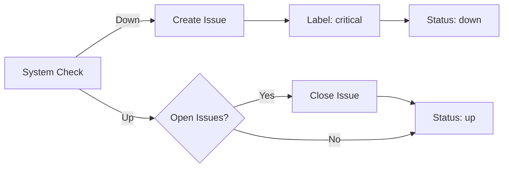

# Docusaurus Status Plugin

A Docusaurus plugin that creates an Upptime-like status monitoring dashboard powered by GitHub Issues and Actions. Perfect for tracking both system uptime and process-based issues, all embedded directly in your Docusaurus documentation site.

[](https://github.com/amiable-dev/docusaurus-plugin-stentorosaur/actions/workflows/ci.yml)
[](https://github.com/amiable-dev/docusaurus-plugin-stentorosaur/actions/workflows/publish.yml)

## Features

- 🎯 **Status Dashboard**: Beautiful, real-time status display for your systems and processes
- 📊 **Incident Timeline**: Historical view of all incidents with severity tracking
- 🔄 **GitHub-Powered**: Uses GitHub Issues for incident tracking and Actions for monitoring
- ⚡ **Real-time Updates**: Automatically updates status via GitHub Actions (hourly by default)
- 🎨 **Customizable**: Fully themeable and configurable to match your site
- 📱 **Responsive**: Works perfectly on all devices
- 🔧 **Flexible**: Track both technical systems AND business/process issues

## Requirements

- **Node.js**: 20.0 or higher
- **Docusaurus**: 3.0 or higher (recommended: 3.9+ for full ES module support)

## Installation

```bash
npm install @amiable-dev/docusaurus-plugin-stentorosaur
# or
yarn add @amiable-dev/docusaurus-plugin-stentorosaur
```

## GitHub Token Setup

The plugin uses a GitHub token to fetch status data from your repository's issues. This token is used in **two different contexts**:

### 1. Local Development & Build (Optional)

For local development and builds, set `process.env.GITHUB_TOKEN` in your environment:

**Create a Personal Access Token (PAT):**

1. Go to [GitHub Settings → Developer settings → Personal access tokens](https://github.com/settings/tokens)
2. Click "Generate new token (classic)"
3. Give it a descriptive name (e.g., "Docusaurus Status Plugin")
4. Select scopes:
   - ✅ `repo` (for private repositories)
   - ✅ `public_repo` (for public repositories only)
5. Generate and copy the token

**Set up locally:**

Create a `.env` file in your Docusaurus project root:

```bash
# .env
GITHUB_TOKEN=ghp_your_token_here
```

Then load it in your `docusaurus.config.js`:

```javascript
// If using dotenv
require('dotenv').config();

module.exports = {
  plugins: [
    [
      '@amiable-dev/docusaurus-plugin-stentorosaur',
      {
        owner: 'your-org',
        repo: 'your-repo',
        token: process.env.GITHUB_TOKEN, // Uses .env token
        systemLabels: ['api', 'website', 'database'],
      },
    ],
  ],
};
```

> **Note:** The token is **optional** for local development. Without it, the plugin will display demo data, which is useful for testing layouts and components.

### 2. GitHub Actions Deployment

When deploying with GitHub Actions, you **must explicitly pass** the `GITHUB_TOKEN` to your build step via the `env:` block.

> ⚠️ **Important:** While `secrets.GITHUB_TOKEN` is automatically available in GitHub Actions workflows, it is NOT automatically in `process.env.GITHUB_TOKEN` unless you explicitly pass it via `env:`.

**For GitHub Pages deployment**, use the standard Docusaurus deployment workflow:

> 📚 **Reference:** [Docusaurus Deployment Documentation](https://docusaurus.io/docs/deployment#triggering-deployment-with-github-actions)

```yaml
# .github/workflows/deploy.yml
name: Deploy to GitHub Pages

on:
  push:
    branches:
      - main
    # Review gh actions docs if you want to further define triggers, paths, etc
    # https://docs.github.com/en/actions/using-workflows/workflow-syntax-for-github-actions#on

jobs:
  build:
    name: Build Docusaurus
    runs-on: ubuntu-latest
    steps:
      - uses: actions/checkout@v4
        with:
          fetch-depth: 0
      - uses: actions/setup-node@v4
        with:
          node-version: 20
          cache: npm

      - name: Install dependencies
        run: npm ci
      - name: Build website
        env:
          GITHUB_TOKEN: ${{ secrets.GITHUB_TOKEN }}
        run: npm run build

      - name: Upload Build Artifact
        uses: actions/upload-pages-artifact@v3
        with:
          path: build

  deploy:
    name: Deploy to GitHub Pages
    needs: build

    # Grant GITHUB_TOKEN the permissions required to make a Pages deployment
    permissions:
      pages: write      # to deploy to Pages
      id-token: write   # to verify the deployment originates from an appropriate source

    # Deploy to the github-pages environment
    environment:
      name: github-pages
      url: ${{ steps.deployment.outputs.page_url }}

    runs-on: ubuntu-latest
    steps:
      - name: Deploy to GitHub Pages
        id: deployment
        uses: actions/deploy-pages@v4
```

For **test deployments on pull requests**, create a separate workflow:

```yaml
# .github/workflows/test-deploy.yml
name: Test deployment

on:
  pull_request:
    branches:
      - main
    # Review gh actions docs if you want to further define triggers, paths, etc
    # https://docs.github.com/en/actions/using-workflows/workflow-syntax-for-github-actions#on

jobs:
  test-deploy:
    name: Test deployment
    runs-on: ubuntu-latest
    steps:
      - uses: actions/checkout@v4
        with:
          fetch-depth: 0
      - uses: actions/setup-node@v4
        with:
          node-version: 20
          cache: npm

      - name: Install dependencies
        run: npm ci
      - name: Test build website
        env:
          GITHUB_TOKEN: ${{ secrets.GITHUB_TOKEN }}
        run: npm run build
```

**Key Points:**

- ✅ **Separate workflows** - Use `deploy.yml` for deployments and `test-deploy.yml` for PR testing
- ✅ **Modern actions** - Uses `actions/deploy-pages@v4` instead of deprecated peaceiris actions
- ✅ **Proper permissions** - Configures `pages: write` and `id-token: write` for GitHub Pages
- ✅ **Build artifacts** - Uses `actions/upload-pages-artifact@v3` to pass build between jobs
- ✅ **GITHUB_TOKEN** - Must pass via `env:` block in build step
- ✅ **Fetch depth** - Uses `fetch-depth: 0` for full git history (useful for git-based features)
- ✅ **Node caching** - Enables npm caching with `cache: npm` (or `cache: yarn` for Yarn users)

> 📖 **Using Yarn?** Replace `cache: npm` with `cache: yarn` and `npm ci` with `yarn install --frozen-lockfile`

> 💡 **Tip:** If your production site shows demo data, you forgot to add the `env:` block to your build step!

### 3. Other CI/CD Platforms

For platforms like Netlify, Vercel, or custom CI/CD:

1. Create a GitHub PAT (as described above)
2. Add it as an environment variable in your platform's dashboard:
   - **Netlify**: Site settings → Build & deploy → Environment → Environment variables
   - **Vercel**: Project settings → Environment Variables
   - **Custom CI**: Add to your CI platform's secrets/environment variables

Set the variable name as `GITHUB_TOKEN` with your PAT value.

## Configuration

### Basic Setup

Add the plugin to your `docusaurus.config.js`:

```javascript
module.exports = {
  // ... other config
  plugins: [
    [
      '@amiable-dev/docusaurus-plugin-stentorosaur',
      {
        // GitHub repository (defaults to site's organizationName/projectName)
        owner: 'your-org',
        repo: 'your-repo',
        
        // Systems/processes to track
        systemLabels: [
          'api',
          'website',
          'database',
          'authentication',
          'deployment',
          'documentation'
        ],
        
        // Optional: GitHub token for API requests
        // Best practice: use environment variable
        token: process.env.GITHUB_TOKEN,
        
        // Status page configuration
        title: 'System Status',
        description: 'Current status of our systems and services',
        
        // Display options
        showResponseTimes: true,
        showUptime: true,
        
        // NEW: Demo data control (useful for testing)
        // Default: true when no token, false when token provided
        useDemoData: !process.env.GITHUB_TOKEN,
        
        // NEW: Content visibility
        showServices: true,    // Show/hide services status board (default: true)
        showIncidents: true,   // Show/hide incident history (default: true)
        
        // Update interval in minutes (default: 60)
        updateInterval: 60,
      },
    ],
  ],
};
```

### GitHub Actions Setup

#### 1. Copy Workflow Templates

Copy the workflow files from `templates/workflows/` to your `.github/workflows/` directory:

```bash
mkdir -p .github/workflows
cp node_modules/@amiable-dev/docusaurus-plugin-stentorosaur/templates/workflows/*.yml .github/workflows/
```

#### 2. Configure Monitoring

Edit `.github/workflows/monitor-systems.yml` to define your endpoints:

```yaml
strategy:
  matrix:
    system: 
      - name: 'api'
        url: 'https://api.example.com/health'
      - name: 'website'
        url: 'https://example.com'
      - name: 'database'
        url: 'https://db.example.com/status'
```

#### 3. Setup Issue Templates (Optional)

Copy the issue template for manual status reporting:

```bash
mkdir -p .github/ISSUE_TEMPLATE
cp node_modules/@amiable-dev/docusaurus-plugin-stentorosaur/templates/ISSUE_TEMPLATE/*.yml .github/ISSUE_TEMPLATE/
```

## Usage

### Viewing the Status Page

Once configured, the plugin automatically creates a `/status` route on your Docusaurus site.

Visit `https://your-site.com/status` to see the status dashboard.

### Embedding Status Components

You can also embed status components in your docs or blog posts:

```mdx
---
title: System Status
---

import StatusBoard from '@theme/StatusBoard';
import IncidentHistory from '@theme/IncidentHistory';

# Our Systems

<StatusBoard 
  items={[
    { name: 'API', status: 'up', uptime: '99.9%' },
    { name: 'Website', status: 'up', uptime: '99.95%' },
    { name: 'Database', status: 'degraded', uptime: '98.5%' }
  ]}
/>

## Recent Incidents

<IncidentHistory 
  incidents={[
    // Your incident data
  ]}
  maxItems={5}
/>
```

### Issue Labeling

The plugin uses GitHub issue labels to track status:

**Required Labels:**
- `status` - Identifies status-related issues

**System Labels:**
- Use labels matching your `systemLabels` config to tag which system is affected
- Example: `api`, `website`, `database`, etc.

**Severity Labels:**
- `critical` - Complete outage
- `major` - Significant degradation
- `minor` - Partial issues  
- `maintenance` - Planned work

### Manual Status Updates

You can manually create status issues using:

1. **GitHub UI**: Use the issue template at `.github/ISSUE_TEMPLATE/status-issue.yml`
2. **API/CLI**: Create issues programmatically with appropriate labels
3. **Automation**: Trigger from your monitoring tools (PagerDuty, DataDog, etc.)

### CLI Tool

The plugin includes a CLI tool for updating status data:

```bash
npx stentorosaur-update-status
```

**Options:**

- `--help` - Show usage information and examples
- `--output-dir <path>` - Specify custom output directory (default: `build/status-data`)
- `--verbose` - Enable detailed logging for debugging
- `--commit` - Auto-commit changes with emoji messages (🟩🟨🟥📊)

**Examples:**

```bash
# Update status data with verbose logging
npx stentorosaur-update-status --verbose

# Update and commit changes automatically
npx stentorosaur-update-status --commit

# Custom output directory
npx stentorosaur-update-status --output-dir ./public/status

# Combine multiple options
npx stentorosaur-update-status --verbose --commit --output-dir ./public/status
```

The CLI tool:

- Fetches status issues from GitHub
- Generates status data files (`summary.json` and `status.json`)
- Optionally commits changes with descriptive emoji messages
- Can be used in local development or CI/CD pipelines
- Provides helpful error messages with examples

## Configuration Options

### Full Options Reference

```typescript
{
  // GitHub repository (required unless using demo data)
  owner: 'your-org',
  repo: 'your-repo',
  
  // System labels to track (optional, default: [])
  systemLabels: ['api', 'web', 'database'],
  
  // GitHub token (optional but recommended)
  token: process.env.GITHUB_TOKEN,
  
  // Page metadata
  title: 'System Status',                    // default: 'Status'
  description: 'Current operational status', // default: ''
  
  // Demo data control
  useDemoData: false,                        // default: true when no token
  
  // Content visibility
  showServices: true,                        // default: true
  showIncidents: true,                       // default: true
  
  // Display features
  showResponseTimes: true,                   // default: false
  showUptime: true,                          // default: false
  
  // Update frequency
  updateInterval: 60,                        // default: 60 minutes
}
```

### Common Configuration Patterns

**Development/Demo**:
```typescript
{
  title: 'Demo Status',
  useDemoData: true,  // Shows demo services and incidents
}
```

**Production**:
```typescript
{
  owner: 'your-org',
  repo: 'status-tracking',
  token: process.env.GITHUB_TOKEN,
  systemLabels: ['api', 'web', 'database'],
  useDemoData: false,  // Only show real data
}
```

**Services Only**:
```typescript
{
  owner: 'your-org',
  repo: 'status-tracking',
  token: process.env.GITHUB_TOKEN,
  showServices: true,
  showIncidents: false,  // Hide incident timeline
}
```

See [CONFIGURATION.md](./CONFIGURATION.md) for detailed examples.

## How It Works

### Architecture

```
GitHub Issues (Status Tracking)
    ↓
GitHub Actions (Monitoring + Data Collection)
    ↓
Plugin API (GitHub Service)
    ↓
Status Data (JSON)
    ↓
React Components (UI)
    ↓
Docusaurus Page (/status)
```

### Data Flow

1. **Monitoring**: GitHub Actions run on schedule (every 5 min for system checks)
2. **Issue Creation**: When a system goes down, an issue is automatically created
3. **Data Collection**: Hourly action fetches all status issues via GitHub API
4. **Status Generation**: Plugin processes issues and generates status items
5. **Build Integration**: Status data is included in Docusaurus build
6. **Display**: React components render the status dashboard

### Issue Lifecycle



## Configuration Options

| Option | Type | Default | Description |
|--------|------|---------|-------------|
| `owner` | string | `organizationName` | GitHub repository owner |
| `repo` | string | `projectName` | GitHub repository name |
| `statusLabel` | string | `'status'` | Label to filter status issues |
| `systemLabels` | string[] | `[]` | Labels for systems to track |
| `token` | string | `process.env.GITHUB_TOKEN` | GitHub API token |
| `updateInterval` | number | `60` | Update frequency (minutes) |
| `dataPath` | string | `'status-data'` | Where to store status data |
| `title` | string | `'System Status'` | Status page title |
| `description` | string | `'Current status...'` | Status page description |
| `showResponseTimes` | boolean | `true` | Display response times |
| `showUptime` | boolean | `true` | Display uptime percentages |

## Components API

### StatusBoard

Displays the overall status of all systems.

```tsx
interface StatusBoardProps {
  items: StatusItem[];
  title?: string;
  description?: string;
}
```

### StatusItem

Displays a single system's status.

```tsx
interface StatusItemProps {
  item: StatusItem;
  showResponseTime?: boolean;
  showUptime?: boolean;
}
```

### IncidentHistory

Displays a timeline of incidents.

```tsx
interface IncidentHistoryProps {
  incidents: StatusIncident[];
  maxItems?: number;
}
```

## Examples

### Tracking Process Issues

Beyond technical systems, you can track business processes:

```javascript
systemLabels: [
  'onboarding',
  'support-tickets',
  'documentation-updates',
  'content-review',
  'deployment-approval'
]
```

Then create issues with these labels to track:
- Delayed onboarding processes
- Support ticket backlogs
- Documentation that needs updating
- Content awaiting review
- Deployment approvals pending

### Custom Severity Levels

Use labels creatively for your needs:

```yaml
labels: 
  - status
  - api
  - degraded  # Custom severity
  - investigating  # Custom status
```

## Best Practices

1. **Use Descriptive Titles**: Make issue titles clear and actionable
2. **Update Issues**: Add comments to issues with progress updates
3. **Close When Resolved**: Always close issues when problems are fixed
4. **Label Consistently**: Use the same labels across all status issues
5. **Monitor Regularly**: Review your monitoring workflow frequency
6. **Set Up Alerts**: Configure GitHub notifications for status issues

## Troubleshooting

### Production site shows demo data instead of real status

**Problem**: Your deployed site shows "Demo API", "Demo Website", etc. instead of your real systems.

**Cause**: `GITHUB_TOKEN` is not available in `process.env` during the build.

**Solution**: Add the `env:` block to your build step:

```yaml
- name: Build website
  env:
    GITHUB_TOKEN: ${{ secrets.GITHUB_TOKEN }}  # ← Add this!
  run: npm run build
```

See the [GitHub Actions Deployment](#2-github-actions-deployment) section for full example.

### Status page shows no data

- Ensure GitHub Actions have run at least once
- Check that issues have the correct `status` label
- Verify `systemLabels` match your issue labels

### Authentication errors

- Make sure `GITHUB_TOKEN` is set correctly
- For private repos, ensure token has `repo` scope
- Check token hasn't expired

### Components not found

- Run `npm install` to ensure dependencies are installed
- Check TypeScript compilation succeeded
- Verify theme path configuration

## Contributing

Contributions are welcome! Please see [CONTRIBUTING.md](./CONTRIBUTING.md) for development setup, testing guidelines, and pull request process.

## Support

- **Issues**: [GitHub Issues](https://github.com/amiable-dev/docusaurus-plugin-stentorosaur/issues)
- **Discussions**: [GitHub Discussions](https://github.com/amiable-dev/docusaurus-plugin-stentorosaur/discussions)
- **Documentation**: See [CONFIGURATION.md](./CONFIGURATION.md) for detailed examples

## License

MIT © Amiable Development

## Credits

Inspired by [Upptime](https://github.com/upptime/upptime) by Anand Chowdhary.
